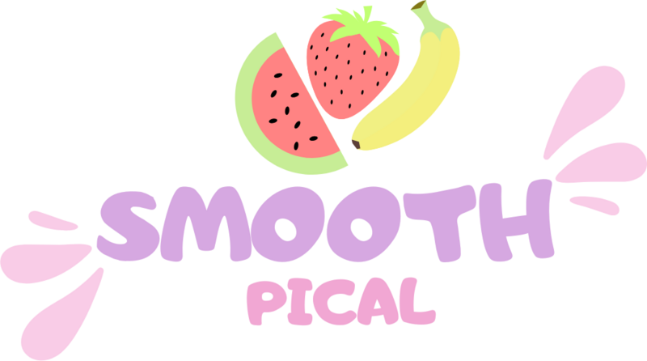

# 🥤 Smooth Pical

<div align="center">




### 🌴 La pausa más rica del día.

Sitio web oficial de **Smooth Pical**, una marca colombiana de smoothies y jugos naturales desarrollada para ofrecer una experiencia moderna, rápida e intuitiva a nuestros clientes.


</div>

---

# 📖 Descripción

Smooth Pical es una página web responsive diseñada para presentar el menú de smoothies y jugos de la empresa, permitiendo que los clientes puedan realizar pedidos de forma sencilla mediante WhatsApp.

El proyecto fue desarrollado utilizando únicamente tecnologías web nativas, priorizando:

- ⚡ Rapidez
- 📱 Compatibilidad móvil
- 🎨 Diseño moderno
- 🍹 Experiencia visual atractiva

---

# ✨ Características

- 🍍 Landing Page moderna
- 🥤 Catálogo interactivo de productos
- 💲 Cálculo automático del total
- ➕ Selector de cantidad
- 📲 Envío directo del pedido por WhatsApp
- 📋 Copiar pedido al portapapeles
- 🌈 Animaciones suaves
- 📱 Diseño Responsive
- 🎯 Navegación intuitiva
- ♿ Accesibilidad básica

---

# 🥤 Productos

Actualmente el menú incluye:

| Producto | Precio |
|----------|---------|
| 🥭 Maracumango | $10.000 |
| 🥭 MangoBoom | $10.000 |
| 🍈 Smoothie de Lulo | $10.000 |
| 🥥 Guanábana con Coco | $10.000 |
| 🍹 Jugo de Lulo | $5.000 |

---

# 📂 Estructura del proyecto

```
SmoothPical/
│
├── assets/
│   ├── logo.png
│   ├── smoothies-menu-2026.png
│   └── ...
│
├── index.html
├── styles.css
├── app.js
├── Code.gs
├── README-PEDIDOS.txt
└── README.md
```

---

# 🚀 Instalación

Clona el repositorio:

```bash
git clone https://github.com/TU-USUARIO/SmoothPical.git
```

Entra al proyecto:

```bash
cd SmoothPical
```

Abre el archivo:

```
index.html
```

No requiere instalación de dependencias.

---

# 📱 Sistema de pedidos

El sitio permite:

- Seleccionar un smoothie.
- Elegir la cantidad.
- Escribir el nombre del cliente.
- Agregar notas.
- Enviar automáticamente el pedido por WhatsApp.

También incluye la integración preparada para:

- Google Sheets
- Google Apps Script
- Telegram (opcional)

Toda la configuración se encuentra documentada en:

```
README-PEDIDOS.txt
```

---

# 💻 Tecnologías

- HTML5
- CSS3
- JavaScript (Vanilla)
- Google Apps Script
- WhatsApp API

---

# 🎨 Diseño

El sitio fue diseñado siguiendo una identidad tropical utilizando:

- Colores vibrantes
- Animaciones suaves
- Tipografía amigable
- Componentes modernos
- Experiencia Mobile First

---

# 📸 Vista previa

> Agrega aquí algunas capturas de pantalla del sitio una vez las tengas.

---

# 📌 Estado del proyecto

🟢 En desarrollo activo

Próximas mejoras:

- [ ] Panel administrativo
- [ ] Carrito de compras
- [ ] Pago en línea
- [ ] Historial de pedidos
- [ ] Estadísticas de ventas
- [ ] Sistema de usuarios

---

# 🤝 Contribuciones

Las contribuciones son bienvenidas.

Si deseas mejorar el proyecto:

1. Haz un Fork.
2. Crea una rama.
3. Realiza tus cambios.
4. Envía un Pull Request.

---

# 👨‍💻 Autor

**Julian Sanguino Ramírez**

Desarrollador del proyecto Smooth Pical.

---

# 📄 Licencia

Este proyecto se distribuye bajo la licencia MIT.

---

<div align="center">

## 🌴 Smooth Pical

**Frescura que se disfruta en cada sorbo.**

🥭🍍🥥🍹

</div>
